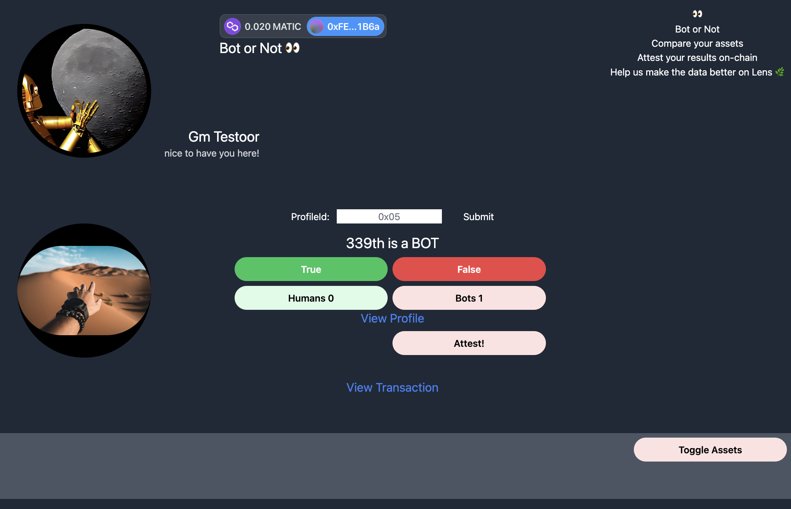

# ETHGlobal Tokyo 2023 

## Are you a human on Lens?

## Short story
Bots are taking over the world and are dangerooooous. It is up to us the users the start contributing to fight against them.
Let's go. Be the superhero. Earn blockchain cred by executing your insights on-chain. Labeling bots and humans not only helps to poor false positive souls but also helps the devs build better models to find them.

## Execution:

### Mission
- Analyse your data vs other lens users if not on lens analyse if you are worth of getting a profile?
- Classify lens users with multiple metrics from bigquery and onchain data
- Log in with metamask sdk or email
- Contribute and take part to data correctness via attestation gnosis safe or optimism
- Show attestations using subgraph / new product if polygon
- Pay fees powered by safe
- Stream me a coffee while interacting with the app

- If you need a profile. Use openai to build you a profile image + name
- Claim profile. Get notified via metamask API or save the specs to your memory when ready to go

## Plan:

### Day 1
Generate dataset
Generate labels
Train model
make predictions
explain predictions
serve predictions

### Day 2
Deploy UI
Login ?
Lens user ?
Are you a bot?
Verify prediction correctness
Explainability

### Data sources
Data from karma3labs
queries from Flipsidecrypto 
queries from zerion apis
queries from 
Lens Bigquery 

